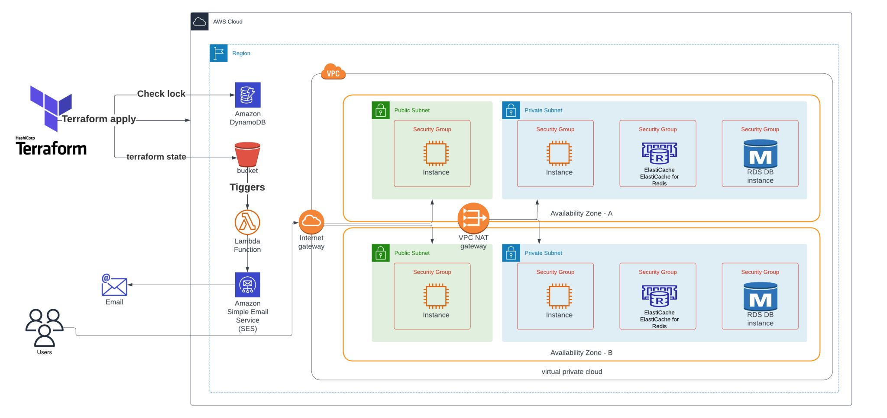

# Terraform Project ITI
#### `network module` - `workspaces` - `dynamodb state lock` - `bastion`
## Create private application and bastion host infrastructure using Terraform on AWS
### Overview:
- Setting up two workspaces environment (development and production) .
- Saving the Terraform state in S3 bucket that triggers lambda function that sends email every new update.
- Creating dynamo DB to store lock file.
- Using modules to organize code and improve reusability.
- Creating VPC with public and private subnets in multiple AZs.
- Launching bastion host EC2 instances with security groups.
- Deploying RDS and Elasticache DB in private subnets.
 

### Network design:
* - create vpc
* - create internet gateway
* - create natgateway
* - create public route table
* - create private route table
* - create public route
* - create private route
* - create two public subnets
* - create two private subnets
* - attach public route table to public subnets
* - attach private route table to private subnets
* - create s3 backend
* - create dynamodb state lock

### App-bastion design:
* - create security group which allow ssh from 0.0.0.0/0
* - create security group that allow ssh and port 3000 from vpc cidr only
* - create ec2 (bastion) in public subnet with security group from 7
* - create ec2 (application) private subnet with security group from 8
* - create two workspaces dev and prod
* - create two variable definition files(.tfvars) for the two environments
* - separate network resources into network module
* - apply your code to create two environments one in us-east-1 and eu-central-1
* - create rds (mysql)
* - create elastic cache
